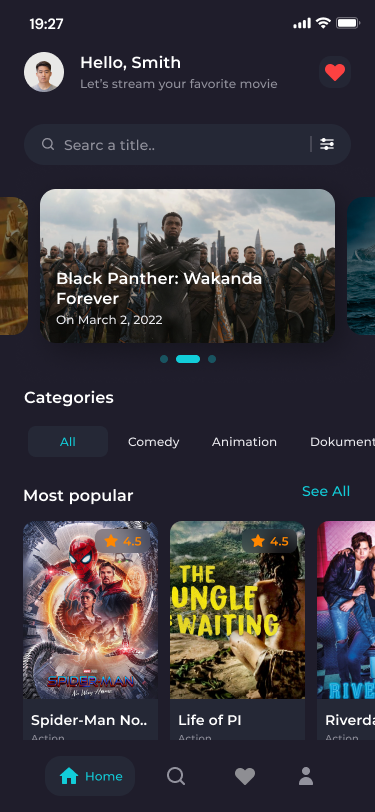
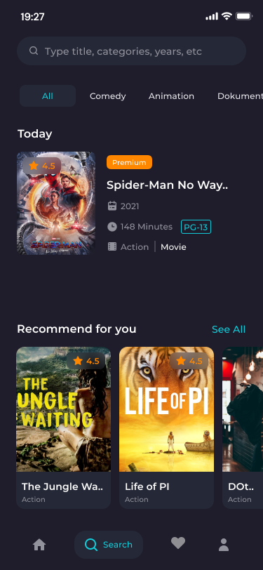
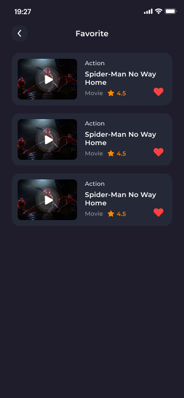
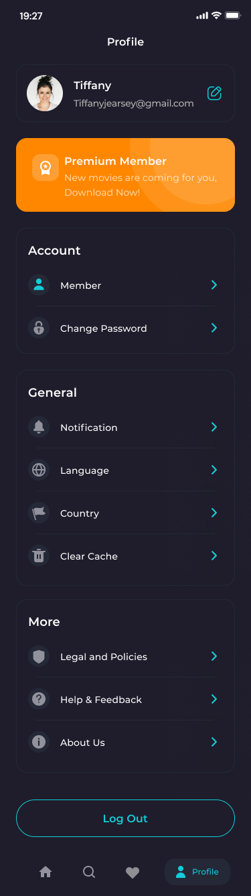
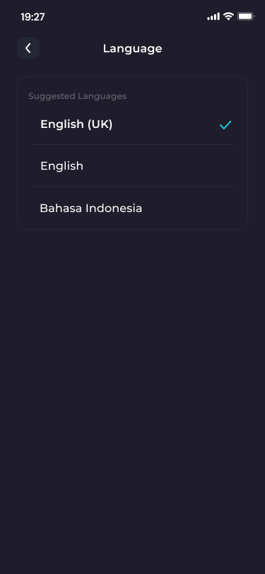
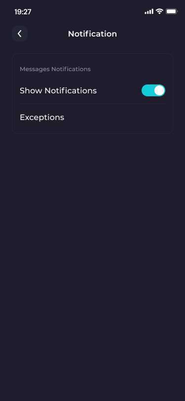
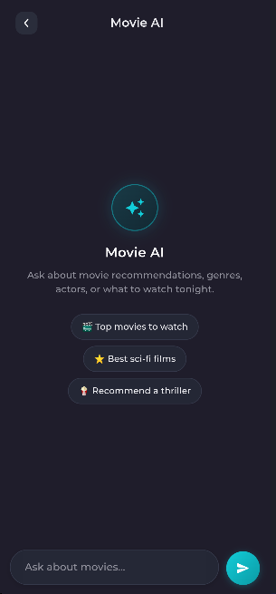

# Movie App 🎬

A Flutter movie application built with Flutter and Clean Architecture.

## 📱 Screenshots

### Splash Screen

  

### Onboarding

  
  
  

## 🔐 Authentication

### Get Started

  

### Login

  

### Sign Up

  

### Reset Password

  

### Verify Account

  

### Create New Password

  

## 🏠 Home

  
  

## 🔎 Search

### Search

  

### Search Results

  

### Search by Actor

  

### Empty Search

  

## 🎬 Movie Details

  

## ❤️ Favorites

### Favorites

  

### Empty Favorites

  

## 👤 Profile

### Profile

  

### Edit Profile

  

### Language

  

### Notifications

  

### Privacy Policy

  

## 🤖 Gemini AI

  

The app includes a Gemini-powered AI movie assistant that can:

* Recommend movies based on the user's request
* Answer movie-related questions
* Understand follow-up questions using the current conversation context
* Edit sent user messages
* Copy AI responses
* Support Arabic and English

## 🎥 Demo Video

<!-- Add the demo video here -->

## ✨ Features

* Splash Screen
* Onboarding flow
* User authentication
* Login
* Sign Up
* Google Authentication
* Facebook Authentication
* Reset Password
* Account verification
* Create New Password
* Home screen
* Movie discovery
* Movie categories
* Movie details
* Search movies
* Search by actor
* Favorites
* Profile management
* Language switching
* Notifications
* Privacy Policy
* Gemini AI movie assistant
* Responsive UI
* Clean Architecture
* Firebase Authentication
* TMDB API integration

## 🛠️ Technologies & Tools

* Flutter
* Dart
* Firebase Authentication
* Gemini AI
* TMDB API
* GetX
* Clean Architecture
* Git & GitHub
