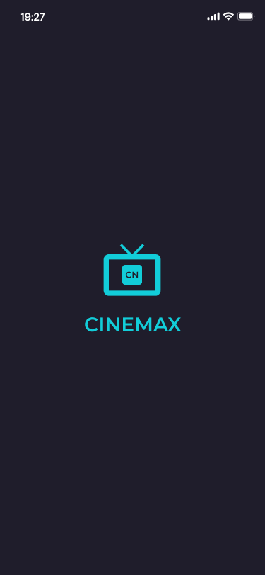
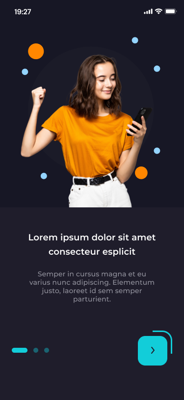
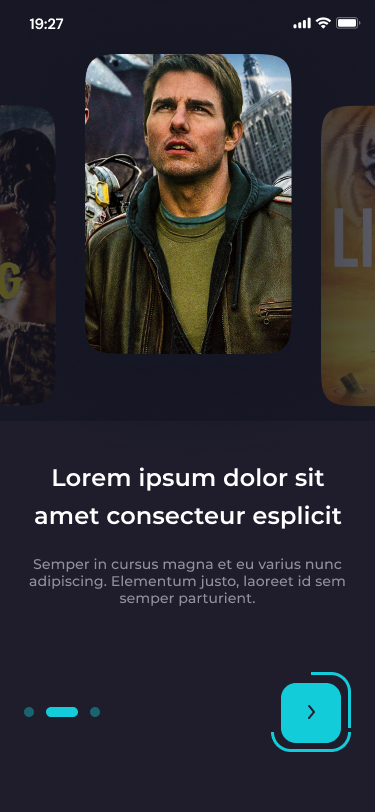
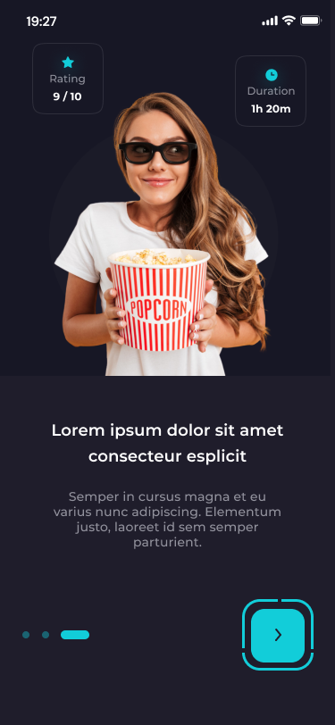
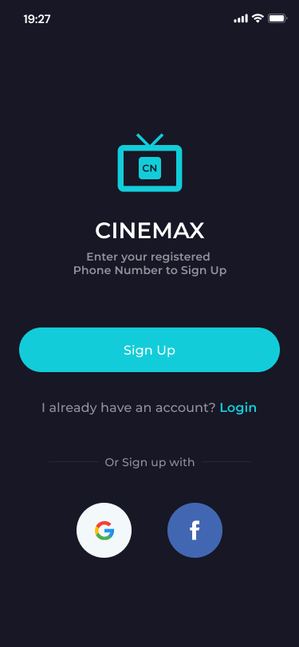
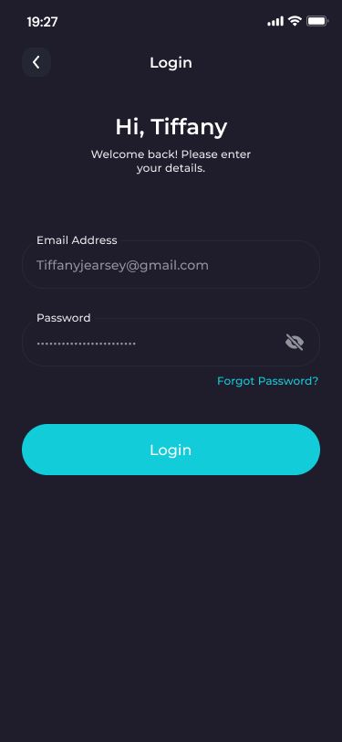
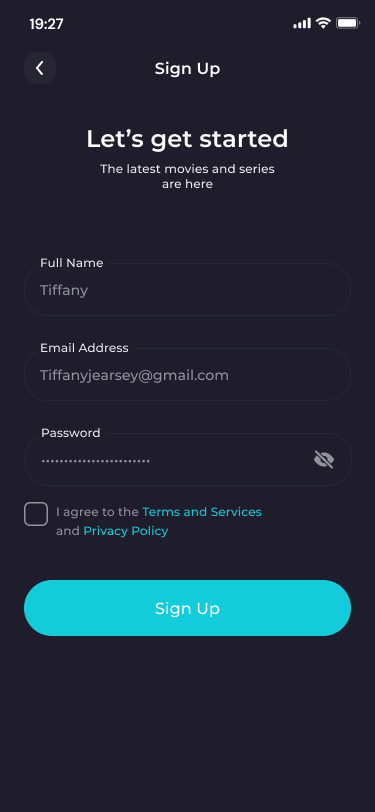
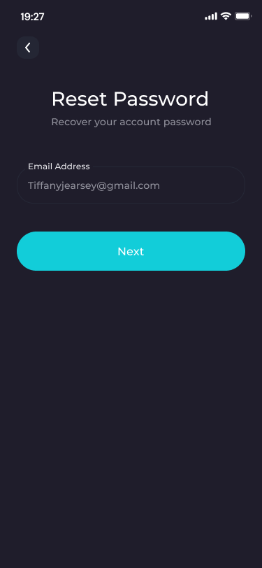
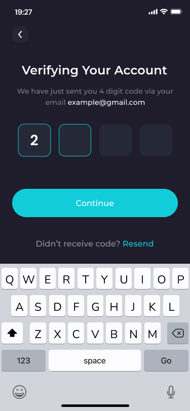
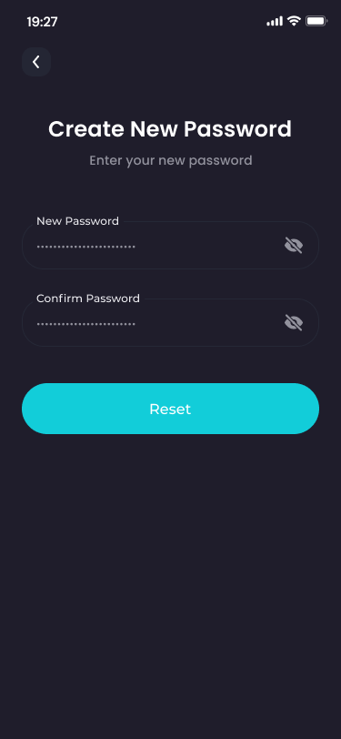

# Movie App 🎬

A Flutter movie application built with Flutter and Clean Architecture.

## 📱 Screenshots

### Splash Screen

  

### Onboarding

  
  
  

## 🔐 Authentication

### Get Started

  

### Login

  

### Sign Up

  

### Reset Password

  

### Verify Account

  

### Create New Password

  

## ✨ Features

- Splash Screen
- Onboarding flow
- User authentication
- Login
- Sign Up
- Google Authentication
- Facebook Authentication
- Reset Password
- Account verification
- Create New Password
- Responsive UI
- Clean Architecture
- Firebase Authentication

## 🛠️ Technologies & Tools

- Flutter
- Dart
- Firebase Authentication
- GetX
- Clean Architecture
- Git & GitHub
